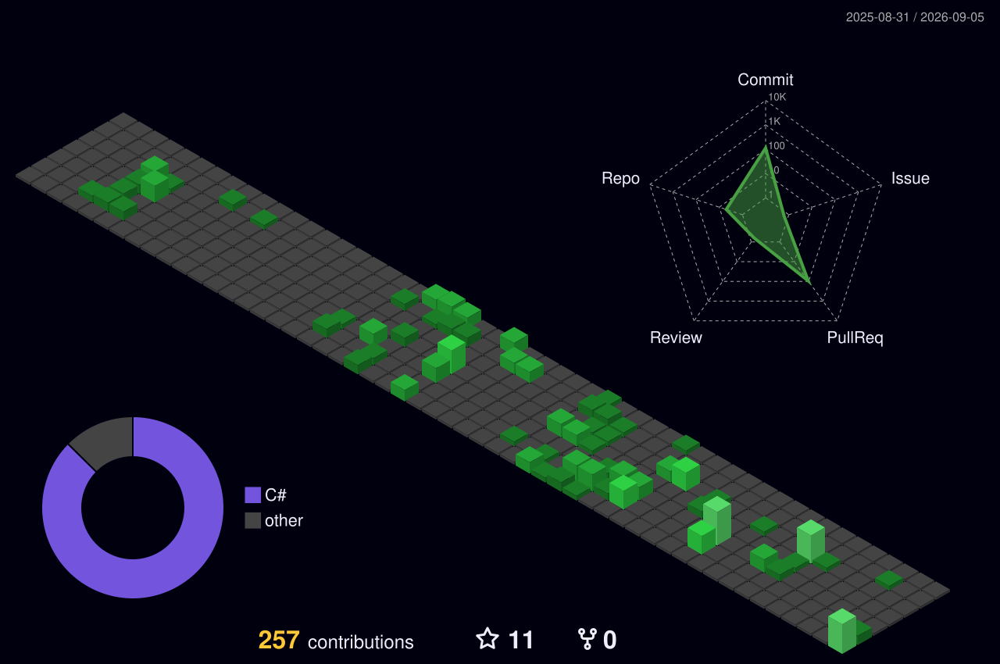

<h1 align="center">Hi 👋, I'm Phạm Hoài Phúc</h1>
<h3 align="center">Backend Developer | .NET & Microservices Enthusiast</h3>

  

  
  

---

### 👨‍💻 About Me

- 🔭 Currently building **SupplyCoreERP** — an ABP Framework ERP system for supply chain & inventory operations
- 🧩 Built **Cube**, a full-featured TypeScript coding-agent CLI on the Mastra framework — auth, tools, memory, workspace config, and its custom terminal UI
- 🌱 Specializing in **Backend Development**: C# / ASP.NET Core, Domain-Driven Design (DDD) & Microservices architecture
- ⚡ Core stack: .NET Core, PostgreSQL, Docker, Angular, TypeScript
- 🎯 Focused on writing clean, scalable, and maintainable systems — from backend architecture to developer-facing UX
- 📫 Reach me at **phuc.ph24012004@gmail.com**

---

### 📌 Featured Projects

<table>
<tr>
<td width="50%" valign="top">

**🏭 [SupplyCoreERP](https://github.com/hphucdev-04/SupplyCoreERP)**

ABP Framework layered-monolith ERP for supply, inventory & business operations.

- ASP.NET Core / .NET 10 backend, Angular 20 frontend
- PostgreSQL + EF Core, OpenIddict auth
- TypeScript MCP server, Docker Compose orchestration
- [Live demo](https://rxlogistics.vercel.app/)

</td>
<td width="50%" valign="top">

**🧩 [Cube](https://github.com/hphucdev-04/cube)**

TypeScript monorepo coding-agent CLI, built end-to-end on the **Mastra** framework.

- 3 auth modes: **API key**, **subscription**, and **local model**
- Full tool system, workspace management, memory (Mastra Observational Memory), and file-based config
- Custom terminal UI (`pi-tui`) with a WCAG 2.1 / OKLCH-audited multi-theme system
- Slash commands (`/model`, `/resume`, `/fork`, `/compact`), subagent delegation, diff-approval UI

</td>
</tr>
</table>

---

### 🛠 Tech Stack & Tools

**Languages**

  
  
  

**Frameworks**

  
  
  
  

**Database**

  
  
  

**DevOps & Tools**

  
  
  
  

**Coding Tools**

  
  
  
  

---

### 🧊 3D Contributions

  

Ảnh trên do GitHub Actions tự sinh và commit thẳng vào repo (xem <code>.github/workflows/profile-assets.yml</code>) — không gọi API bên ngoài lúc hiển thị nên không bao giờ lỗi fetch. Chạy tay trong tab <b>Actions → Generate Profile Assets → Run workflow</b> để tạo lần đầu / cập nhật lại.

---

  

<i>⭐ Always open to collaborating on backend & microservices projects.</i>

